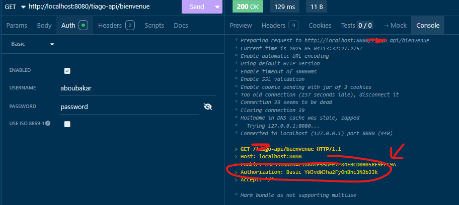

# Singletons et gestion des utilisateurs avec Spring

## Introduction

Spring est fondamentalement basé sur des singletons - ces instances de classes uniques partagées à travers toute l'application 🔄. Cette approche est au cœur du fonctionnement du framework, comme le confirme la [documentation officielle de Spring](https://docs.spring.io/spring-framework/reference/core/beans/factory-scopes.html).

Dans le contexte d'une API REST, ce principe implique que deux utilisateurs distincts interagissent avec la même instance d'un contrôleur. Ce fonctionnement soulève une question cruciale : comment récupérer et traiter les informations spécifiques à chaque utilisateur tout en préservant la confidentialité des données ?

Heureusement, Spring Security et son composant SecurityContextHolder offrent une solution élégante à ce défi technique.

## Niveau 1 : Le traitement générique sans authentification

### Scénario 1 :
En tant qu'utilisateur quelconque,  
Lorsque j'envoie une requête HTTP : `GET /bienvenue`  
Je veux recevoir "bienvenue !"

### Implémentation

Grâce à l'auto-configuration de Spring Boot ✨, une seule dépendance est nécessaire :
```xml
<dependency>  
    <groupId>org.springframework.boot</groupId>  
    <artifactId>spring-boot-starter-web</artifactId>  
</dependency>
```

Ensuite, il suffit de créer le contrôleur et la méthode qui répondra à notre requête HTTP :
```java
@RestController  
public class AccueilController {  
    @GetMapping("/bienvenue")  
    public String accueillir() {  
       return "bienvenue !";  
    }  
}
```

Résultat du test : ✅

### Explication :
Examinons ce qui se passe en coulisses :

1. L'annotation `@RestController` permet à Spring Boot de marquer la classe `AccueilController` comme bean. Lors du démarrage de l'application, Spring crée **une seule** instance de la classe `AccueilController`. Cette instance unique est créée et enregistrée dans l'ApplicationContext - le conteneur principal qui gère tous les beans Spring.

> **Pourquoi une seule instance?** L'annotation `@RestController` inclut implicitement `@Component`, l'un des [stéréotypes fondamentaux de Spring](https://docs.spring.io/spring-framework/reference/core/beans/classpath-scanning.html#beans-stereotype-annotations). Par défaut, Spring utilise le scope singleton pour ces composants.

2. Toujours lors du démarrage : Spring crée un mapping entre la requête HTTP "GET /bienvenue" et la méthode `AccueilController::accueillir`.

3. Lors de notre test, la requête "GET /bienvenue" est reçue par l'application. Grâce au mapping établi précédemment, la méthode de l'instance unique du contrôleur est appelée.

> Pour acheminer la requête vers la méthode appropriée, Spring implémente le [design pattern Front Controller](https://www.baeldung.com/spring-controllers) via la classe `DispatcherServlet`. Cette classe centrale agit comme un aiguilleur 🚦 qui dirige chaque requête vers le bon contrôleur.

## Niveau 2 : Le traitement spécifique par utilisateur

### Scénario 2A :
En tant qu'utilisateur Aboubakar,  
Lorsque j'envoie une requête HTTP : `GET /bienvenue`  
Je veux recevoir "bienvenue Aboubakar !"

### Scénario 2B :
En tant qu'utilisatrice Béatrice,  
Lorsque j'envoie une requête HTTP : `GET /bienvenue`  
Je veux recevoir "bienvenue Béatrice !"

### Implémentation

Nous introduisons maintenant la notion d'utilisateur authentifié !
🔐 Spring Security devient essentiel pour cette fonctionnalité.

Voici notre plan d'implémentation étape par étape :
- Adapter le socle de notre application
- Déclarer des utilisateurs autorisés à se connecter
- Protéger nos endpoints sensibles contre les intrus
- Authentifier nos utilisateurs lors des appels
- Récupérer les informations de l'utilisateur connecté

#### 1. Adapter le socle

Pour ajouter Spring Security, il suffit d'inclure la dépendance suivante dans le `pom.xml` :

```xml
<dependency>  
    <groupId>org.springframework.boot</groupId>  
    <artifactId>spring-boot-starter-security</artifactId>  
</dependency>
```

> **Attention** : Dans ce projet, j'utilise la version 3.3.x de Spring Boot. Il se peut que d'autres étapes soient nécessaires si vous utilisez des versions antérieures (comme ajouter une configuration `@EnableWebSecurity`).

#### 2. Déclarer des utilisateurs

> **Attention** : À ne jamais faire en production ! Dans cette application de démonstration, nous déclarons simplement deux utilisateurs de test : Aboubakar et Béatrice.

```java
@Configuration  
public class SecurityConfig {  
    @Bean  
    public UserDetailsService users() {  
       return new InMemoryUserDetailsManager(  
             User.builder()  
                   .username("beatrice")  
                   .password("{noop}password")  
                   .build(),  
             User.builder()  
                   .username("aboubakar")  
                   .password("{noop}password")  
                   .build()  
       );  
    }
}
```

#### 3. Protéger les endpoints

En réalité, nul besoin de faire un changement spécifique pour protéger nos endpoints. Le simple fait d'ajouter la dépendance Spring Security au projet ferme automatiquement les endpoints de l'application aux utilisateurs non authentifiés ! Comme le dit la [documentation officielle](https://docs.spring.io/spring-boot/docs/2.0.x/reference/html/boot-features-security.html) :

> "If Spring Security is on the classpath, then web applications are secured by default."

Cette sécurité par défaut illustre parfaitement le principe "convention over configuration" de Spring Boot ! 🛡️

#### 4. Authentifier des utilisateurs lors des appels

Place aux HTTP headers ! Si vous utilisez un outil de requête HTTP comme Insomnia ou Postman, il suffit de renseigner l'onglet "Auth". Cela crée automatiquement un header "Authorization" avec la valeur "Basic XXX" :


La structure du header est la suivante :
- "Basic " : indique la méthode d'authentification utilisée ([Basic](https://en.wikipedia.org/wiki/Basic_access_authentication), [Bearer](https://en.wikipedia.org/wiki/OAuth)...)
- La chaîne "YWJvdWJha2FyOnBhc3N3b3Jk" représente simplement notre paire utilisateur/mot de passe encodée en base64, conformément à la [spécification HTTP](https://developer.mozilla.org/fr/docs/Web/HTTP/Authentication).

#### 5. Récupérer les informations de l'utilisateur

Voici comment accéder à l'identité de l'utilisateur connecté :

```java
@RestController  
public class UserDataController {  
  
    @GetMapping("/quisuisje")  
    public ResponseEntity<String> whoami() {  
       UserDetails userConnecte = (UserDetails) SecurityContextHolder  
             .getContext()  
             .getAuthentication()  
             .getPrincipal();  
       return ResponseEntity.ok(userConnecte.getUsername());  
    }  
}
```

(wip...)

## Conclusion

Mission accomplie ! ✅ En quelques étapes seulement, nous avons transformé notre application générique en une application capable d'identifier et de personnaliser l'expérience de chaque utilisateur.

Spring Security nous offre un mécanisme robuste pour gérer l'authentification et l'autorisation, tout en respectant le principe fondamental des singletons qui caractérise le framework Spring. Le `SecurityContextHolder` fonctionne comme un [contexte de sécurité thread-local](https://docs.spring.io/spring-security/reference/servlet/authentication/architecture.html#servlet-authentication-securitycontextholder) qui préserve l'identité de l'utilisateur courant pour chaque requête traitée.

Pour enrichir davantage vos applications, n'hésitez pas à explorer les fonctionnalités avancées de Spring Security :
- Gestion des rôles et des autorisations
- Authentification OAuth2
- Tokens JWT
- Protection CSRF
- Sessions sécurisées

📝 **Important** : En environnement de production, certaines bonnes pratiques sont essentielles :
- Ne jamais stocker de mots de passe en clair
- Utiliser des connexions HTTPS systématiquement
- Implémenter un mécanisme de gestion des mots de passe robuste
- Effectuer des audits de sécurité réguliers
- Maintenir les dépendances à jour

Cette démonstration illustre parfaitement comment Spring résout élégamment le paradoxe entre un modèle d'exécution basé sur des singletons partagés et la nécessité de traiter des données spécifiques à chaque utilisateur.